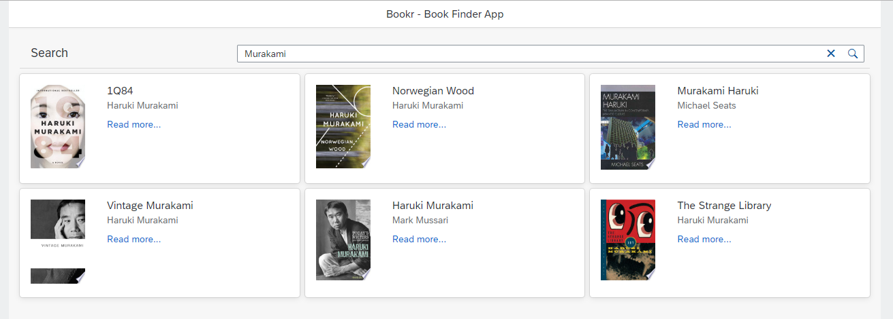

# UI5 PWA To-do List

### [Live Demo](https://jansenpenido.github.io/ui5-bookr/webapp/index.html)

## Overview
A simple [OpenUI5](https://openui5.org/) application that can perform searches for books by name and author. The data is provided by the [Google Book API](https://developers.google.com/books).

This project explores the following concepts:

- Consumption of RESTful API.
- Data binding using JSON model.
- Responsiveness to various screen sizes.

